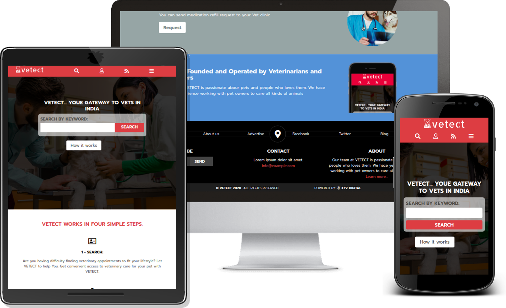
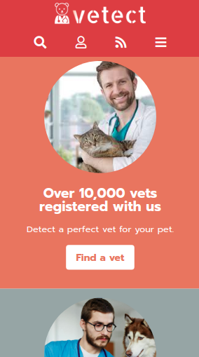
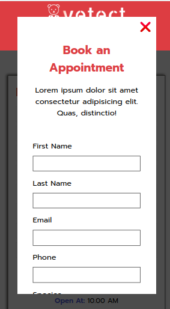
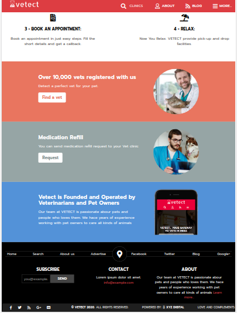
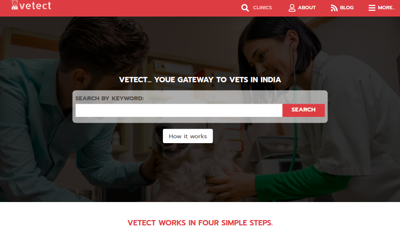

# vetect

> VETECT is the directory of veterinary Hospital, Clinics and Physician. It help you to detect a suitable vet for your pet and you can also book an Appointment with them.

> This is the Capstone Project for HTML and CSS Module under Microverse Main Technical Curriculum section.

## Built With

- HTML and CSS

## Objectives

- Use HTML box model (margin, padding, width and height)
- Use industry-standard tools flexbox to place elements in the page.
- UI adaptable to different screen sizes using mediaquiries
- Apply front-end best practices

## Live Demo

[Live Demo Link](https://kumaramitt.github.io/vetect/.)

## Presentation

[Watch Presentation Video](https://www.loom.com/share/bf2ce9764ab54b14b8902eab7dee426e?sharedAppSource=personal_library)

## Getting Started

To get a local copy up and running follow these simple example steps.

### Prerequisites

- Must have a text editor installed on your machine. You can use any default text editor that comes with the system like Notepad but advanced text editors like Visual Studio Code, Atom or Sublime is recommended.

### Setup

Refer the following documentations to download the Text Editor of youe choice:

[VS Code](https://code.visualstudio.com/)

[Atom](https://atom.io/)

[Sublime Text](https://www.sublimetext.com/)

### Usage
- Clone this Repository using following command

<pre><code>git clone https://github.com/KumarAmitt/vetect.git</code></pre>

- Navigate to the folder TheNextWeb-clone in your File Explorer.

- Run index.html on your browser of preference. Recommended: Chrome/Firefox

- If you wish to play around the codes, navigate to this Repository in the Text Editor of your choice.

## Authors

👤 **Amit Kumar**

- GitHub: [@githubhandle](https://github.com/KumarAmitt)
- Twitter: [@twitterhandle](https://twitter.com/ArrshAmitt)
- LinkedIn: [LinkedIn](https://www.linkedin.com/in/kumar-amitt)

## 🤝 Contributing

Contributions, issues, and feature requests are welcome!

Feel free to check the [issues page](https://github.com/KumarAmitt/vetect/issues).

## Show your support

Give a ⭐️ if you like this project!

## Acknowledgments

- Hat tip to anyone whose code was used
- This projectis inspired by PatashuleKE by Mathew Njuguna and Sam Achola
- UI is inspired by Patashule at behance.net

## 📝 License

&copy; 2020 Amit Kumar & Frederick Mih

Distributed under the Creative Commons License. See the [LICESCE](https://creativecommons.org/licenses/by-nc/4.0/) for more information.